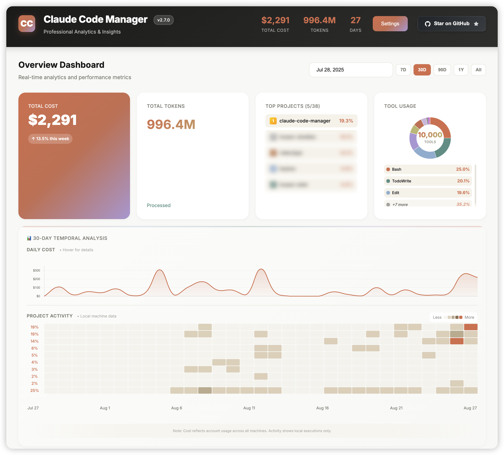

<div align="center">

# Claude Code Manager (CCM)

[](https://www.npmjs.com/package/claude-code-manager)
[](LICENSE)
[](package.json)
[](https://www.npmjs.com/package/claude-code-manager)

**Professional analytics and workflow automation for Claude Code power users**

[Installation](#installation) • [Quick Start](#quick-start) • [Features](#features) • [Documentation](#commands)

</div>

## Overview

Claude Code Manager (CCM) is a comprehensive CLI toolkit that transforms your AI-assisted development workflow. Track execution metrics, monitor costs, manage feature branches, and gain insights through a beautiful analytics dashboard—all with zero configuration.

## Installation

```bash
# Using npm
npm install -g claude-code-manager

# Using pnpm (recommended)
pnpm add -g claude-code-manager

# Using yarn
yarn global add claude-code-manager
```

## Quick Start

```bash
# Initialize tracking (one-time setup)
ccm init

# Launch analytics dashboard
ccm dashboard

# Monitor active sessions
ccm monitor

# Manage feature branches
ccm feat add new-feature
```

### Tab Completion

Enable shell auto-completion for all commands and options:

```bash
ccm completion install    # Install for bash/zsh/fish
source ~/.zshrc          # Reload shell (or restart terminal)
```

Now tab completion works everywhere:
```bash
ccm <Tab>              # List all commands
ccm stat --<Tab>       # Show stat options
ccm statusline <Tab>   # Show statusline subcommands
```

## Features

### 📊 **Analytics Dashboard**
Beautiful web-based dashboard with real-time metrics, cost tracking, and execution heatmaps. Now serves as both a static viewer and API server.

```bash
ccm dashboard              # Launch dashboard server (default: port 3000)
ccm dashboard --port 8080  # Custom port
ccm dashboard --api        # API-only mode
ccm dashboard --no-server  # Static HTML mode (legacy)
```



### 🎨 **Custom Statusline**
Enhance Claude Code with customizable statuslines showing real-time session metrics.

```bash
ccm statusline list              # Show all available statuslines
ccm statusline select vibe-genius # Activate a statusline
ccm statusline config            # Configure ccstatusline (interactive TUI)
ccm statusline test              # Preview with mock data
```

### 🌳 **Git Worktree Management**
Parallel feature development without context switching using Git worktrees.

```bash
ccm feat add payment-api   # Create feature branch & worktree
ccm feat list             # Interactive branch manager
ccm feat merge            # Merge completed features
ccm feat clean            # Remove merged worktrees
```

### 🔍 **Real-Time Monitor**
Live terminal UI displaying active Claude sessions with hierarchical task views.

```bash
ccm monitor               # Launch interactive monitor
# Controls: Tab (filter), Space (expand), Q (quit)
```

### 🧠 **Memory Discovery**
Locate and manage CLAUDE.md configuration files across your entire workspace.

```bash
ccm memory                # Display all memory files
ccm memory --full         # Show complete content
ccm memory --paths-only   # List paths only
```

### 💾 **Zero-Config Tracking**
Automatic execution tracking via PostToolUse hooks—captures all tool usage seamlessly.

```bash
ccm init                  # One-time setup
ccm stat                  # View statistics
ccm stat --current        # Current project only
```

## Commands

### Core Commands

| Command | Description | Key Options |
|---------|-------------|-------------|
| `dashboard` | Web analytics dashboard & API server | `--port`, `--api`, `--no-server` |
| `monitor` | Real-time session monitor | `--filter`, `--order`, `--refresh-interval` |
| `stat` | Session statistics viewer | `--current`, `--analyzer`, `--export` |
| `init` | Initialize tracking | `--force`, `--check` |

### Workflow Commands

| Command | Description | Key Options |
|---------|-------------|-------------|
| `feat` | Git worktree management | `add`, `list`, `merge`, `clean` |
| `statusline` | Custom statusline management | `list`, `select`, `config`, `test` |
| `memory` | Memory file discovery | `--full`, `--paths-only`, `--exclude` |
| `usage` | Token usage & cost reports | `daily`, `monthly`, `--json` |
| `completion` | Shell tab completion | `install`, `uninstall` |

### Maintenance Commands

| Command | Description |
|---------|-------------|
| `backup` | Create configuration backups |
| `slim` | Clean old database entries |
| `track` | Internal hook command |

## API Endpoints

When running `ccm dashboard`, the following REST API endpoints are available:

- `GET /api/executions` - Query execution history
- `GET /api/stats` - Aggregated statistics
- `GET /api/sessions` - Session information
- `GET /api/projects` - Project listings
- `GET /api/dashboard` - Complete dashboard data

## Data Storage

| Location | Purpose |
|----------|---------|
| `~/.claude/db.sql` | Execution tracking database |
| `~/.claude/settings.json` | Claude Code configuration |
| `~/.claude/statusline.sh` | Custom statusline script |
| `~/.claude/CLAUDE.md` | Global memory file |
| `.feats/` | Feature branch worktrees |

## Development

```bash
# Clone repository
git clone https://github.com/markshawn2020/claude-code-manager
cd claude-code-manager

# Install dependencies
pnpm install

# Build project
pnpm build

# Link for development
pnpm link --global
```

## Requirements

- **Node.js** ≥ 18.0.0
- **Git** (for worktree features)
- **Claude Code CLI**
- **jq** (for statusline features)

## Contributing

We welcome contributions! Please see our [Contributing Guide](CONTRIBUTING.md).

1. Fork the repository
2. Create your feature branch (`ccm feat add your-feature`)
3. Commit changes using conventional commits
4. Push to your branch
5. Open a Pull Request

## License

Apache-2.0 © 2024 - See [LICENSE](LICENSE) for details

## Links

<div align="center">

[NPM Package](https://www.npmjs.com/package/claude-code-manager) • 
[GitHub Repository](https://github.com/markshawn2020/claude-code-manager) • 
[Issue Tracker](https://github.com/markshawn2020/claude-code-manager/issues) • 
[Changelog](CHANGELOG.md)

---

**Built with ❤️ for the Claude Code community**  
⭐ Star this repo if you find it useful!

</div>